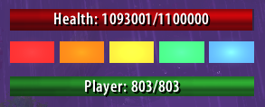

# ComboDroid

A sleek, modern World of Warcraft addon for Turtle WoW and Classic WoW that displays combo points, target health, and player health in a resizable, movable window.

## Features
- Combo points bar with rainbow colors
- Target health bar (turns red in combat)
- Player health bar
- Window is movable, resizable, and content scales
- Dims combo bar if not enough energy to use main ability
- Works for Rogues and Druids (shows message for other classes)
- Slash command `/combodroid` to toggle the window

## Installation
1. Download or clone this repository.
2. Copy the `` folder into your WoW `Interface/AddOns` directory.
3. Restart WoW or reload the UI.

## Usage
- Type `/combodroid` in chat to show or hide the window.
- Use handle in the bottom right to resize or anywhere in window to move.

## Files
- `ComboDroid.lua` — Main addon logic and UI
- `ComboDroid.toc` — Addon metadata

## License
MIT License (see LICENSE file)
